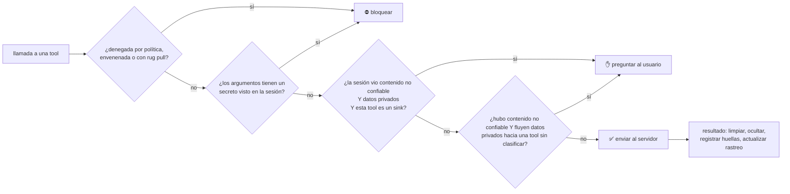

<p align="center">
  
</p>

<p align="center"><a href="README.md">English</a> · <b>Español</b></p>

<p align="center">
  <a href="https://github.com/AnthonyRiveraI/kairoseki/actions/workflows/ci.yml"></a>
  
  
  
  
</p>

<p align="center">
  <b>Un firewall para MCP que detiene el robo de datos por prompt injection siguiendo <i>de dónde vienen los datos</i>,<br/>
  no adivinando cómo se ven los ataques.</b>
</p>

---

En One Piece, el **kairoseki** (piedra marina) anula los poderes de las Frutas del Diablo. Kairoseki hace lo mismo
con el poder más peligroso de tu agente: leer algo que escribió un atacante y luego mandar tus datos a otra parte
sin que te des cuenta.

```bash
uv tool install git+https://github.com/AnthonyRiveraI/kairoseki
kairoseki scan              # ¿qué podría hacer un solo prompt injection con tu configuración MCP?
kairoseki wrap              # protege cada servidor MCP de tu config de Claude / Cursor / VS Code
kairoseki attack            # repite 9 ataques reales contra tu configuración y te da una nota
```

<p align="center"></p>

## Por qué

Un agente es vulnerable **por diseño** cuando tiene las tres piezas de la
[tríada letal](https://simonwillison.net/2025/Jun/16/the-lethal-trifecta/):

1. **acceso a datos privados** (tus archivos, repos, inbox),
2. **exposición a contenido no confiable** (una página web, un issue de GitHub, un correo), y
3. **una forma de enviar datos hacia afuera** (HTTP, email, un comentario, un pull request).

Conecta un servidor de archivos y uno de fetch a Claude Code, Cursor o Claude Desktop y ya tienes las tres.
Esto sigue pasando en el mundo real:

| Incidente | Qué pasó |
| :-- | :-- |
| [Exploit del MCP de GitHub](https://invariantlabs.ai/blog/mcp-github-vulnerability) (may 2025) | Un issue público malicioso hizo que un agente copiara datos de un repo privado en un pull request público |
| [Tool poisoning](https://invariantlabs.ai/blog/mcp-security-notification-tool-poisoning-attacks) (abr 2025) | Instrucciones escondidas en la *descripción* de una tool robaron `~/.cursor/mcp.json` |
| [MCPoison, CVE-2025-54136](https://nvd.nist.gov/vuln/detail/CVE-2025-54136) (jul 2025) | Una configuración MCP ya aprobada fue cambiada en silencio después (rug pull) |
| [Comment and Control](https://oddguan.com/blog/comment-and-control-prompt-injection-credential-theft-claude-code-gemini-cli-github-copilot/) (abr 2026) | Instrucciones en títulos y comentarios de PRs hicieron que Claude Code, Gemini CLI y Copilot filtraran sus propios secretos |

La mayoría de las defensas buscan patrones de ataque en el texto, y el atacante solo tiene que reformular.
Kairoseki rompe la tríada. La idea está inspirada en [CaMeL](https://arxiv.org/abs/2503.18813) (Google DeepMind):
rastrear el origen de los datos durante toda la sesión e intervenir justo cuando se juntan el contenido no confiable,
los datos privados y un canal de salida.

## Qué hace

| | |
| :-- | :-- |
| 🔗 **Rastreo entre servidores** | Todos los `kairoseki run` de una misma sesión comparten estado. La web viene del servidor `fetch`, el secreto de `filesystem` y la fuga sale por `github`: Kairoseki igual ve una sola cadena. |
| 🧪 **Huellas de secretos** | Los secretos que aparecen en la salida de una tool o en el entorno de un servidor se guardan como huella (nunca en texto). Si uno aparece después en una llamada, aunque sea en base64, hex, URL-encoded o al revés, la llamada se bloquea. |
| 🫥 **Ocultamiento** | Las API keys, tokens y llaves privadas se reemplazan por `[REDACTED:tipo]` antes de llegar al modelo. El modelo no puede filtrar lo que nunca vio. |
| ☠️ **Tools envenenadas** | Las descripciones y esquemas con instrucciones maliciosas, códigos ANSI o Unicode invisible se neutralizan antes de que el modelo los lea, y la tool se bloquea. |
| 📌 **Protección contra rug pulls** | La definición de cada tool se fija la primera vez que la ves. Si el servidor la cambia después, esa tool se bloquea hasta que la vuelvas a aprobar. |
| ✋ **Aprobaciones que se adaptan a tu cliente** | Cuando la tríada se cierra, Kairoseki te pregunta: con una ventana dentro de tu cliente (MCP elicitation, en ambas versiones del protocolo) o con un `kairoseki approve K-1A2B3C` desde cualquier terminal. |
| ⚔️ **Laboratorio de ataques y badge** | `kairoseki attack` repite ataques reales contra un agente *totalmente secuestrado* y revisa, del lado del atacante, si el dato secreto se filtró. |
| 🔍 **Escáner** | `kairoseki scan` clasifica cada tool de tu configuración y te dice si ya tienes la tríada letal. |

Es un proxy stdio transparente que habla JSON-RPC directamente, así que funciona con cualquier servidor y cliente MCP,
tanto en la versión con handshake (`initialize`, 2024-11-05 → 2025-11-25) como en la moderna (`server/discover`,
2026-07-28). Solo depende de `pyyaml` y `rich`.

<p align="center"></p>

## Guía rápida

### 0. Requisitos previos

| Necesitas | Para qué | Cómo conseguirlo |
| :-- | :-- | :-- |
| **[uv](https://docs.astral.sh/uv/)** (recomendado) o **pipx** | Instala Kairoseki como una herramienta de línea de comandos aislada | macOS / Linux: `curl -LsSf https://astral.sh/uv/install.sh \| sh`<br/>Windows (PowerShell): `powershell -ExecutionPolicy ByPass -c "irm https://astral.sh/uv/install.ps1 \| iex"` |
| **Python 3.10+** | Kairoseki está escrito en Python | uv descarga un Python compatible automáticamente si no lo tienes. Con pipx, instálalo tú. |
| **Git** | Para instalar directo desde GitHub | [git-scm.com](https://git-scm.com/downloads) |
| **Un cliente MCP** | Algo que proteger | Claude Code, Claude Desktop, Cursor, VS Code, Windsurf... |
| **Node.js** *(opcional)* | Solo si tus servidores MCP arrancan con `npx` | [nodejs.org](https://nodejs.org/) |

### 1. Instalar

Kairoseki todavía no está en PyPI, así que se instala desde GitHub:

```bash
uv tool install git+https://github.com/AnthonyRiveraI/kairoseki
# o con pipx:
pipx install git+https://github.com/AnthonyRiveraI/kairoseki
```

Luego asegúrate de que el comando `kairoseki` esté en tu `PATH` y abre una terminal **nueva**:

```bash
uv tool update-shell     # o: pipx ensurepath
kairoseki --version      # debe mostrar: kairoseki 0.1.1
```

> **¿`kairoseki: command not found`, o tu cliente MCP no lo puede iniciar?** La herramienta se instala en `~/.local/bin`
> (`%USERPROFILE%\.local\bin` en Windows). Corre `uv tool update-shell` y luego reinicia por completo tu terminal **y**
> tu cliente MCP para que lean el nuevo `PATH`. Además, `kairoseki wrap` escribe la ruta absoluta en tu configuración,
> así que evita el problema por completo.

Para actualizar más adelante: `uv tool upgrade kairoseki` (o `pipx upgrade kairoseki`).

> **Windows:** cierra tu cliente MCP (o desactiva sus servidores protegidos con Kairoseki) antes de actualizar.
> Mientras un cliente está usando `kairoseki.exe`, Windows bloquea el archivo y `uv tool upgrade` falla con
> *os error 32*.

### 2. Mira tu exposición

```bash
kairoseki scan
```

Lee la configuración MCP de Claude Desktop, Claude Code, Cursor, Windsurf y VS Code, inicia cada servidor y
clasifica cada tool como `private`, `untrusted`, `sink` y/o `destructive`. En Claude Code incluye los servidores del
proyecto (`.mcp.json`), los de usuario y los servidores *locales* del proyecto actual en `~/.claude.json`; agrega
`--all-projects` para incluir los servidores locales de todos los proyectos.

### 3. Protege tus servidores

```bash
kairoseki wrap            # todas las configuraciones detectadas (primero guarda un respaldo .kairoseki.bak)
kairoseki wrap --undo     # restaurar
kairoseki status          # qué servidores están protegidos y qué ha visto cada sesión activa
```

O protege un solo servidor a mano. Todos los clientes usan el mismo patrón, `kairoseki run --name <nombre> -- <comando original>`:

```jsonc
{
  "mcpServers": {
    "fetch": {
      "command": "kairoseki",
      "args": ["run", "--name", "fetch", "--", "uvx", "mcp-server-fetch"]
    }
  }
}
```

Con Claude Code:

```bash
claude mcp add fetch -- kairoseki run --name fetch -- uvx mcp-server-fetch
```

Reinicia tu cliente y comprueba que el servidor conecta (en Claude Code: `claude mcp get fetch`). Eso es todo.

> **¿Pruebas con `@modelcontextprotocol/server-filesystem`?** Ese servidor reemplaza las carpetas que le pasas por
> línea de comandos con los *roots* del cliente. Claude Code envía la carpeta del proyecto, así que el servidor
> usará esa carpeta y no la de tu configuración.

### 4. Intenta romperlo

```bash
kairoseki attack                        # pon nota a tu política actual
kairoseki attack --badge kairoseki.svg  # y obtén un badge para tu README
```

## Cómo decide



| Modo | Comportamiento |
| :-- | :-- |
| `monitor` | Nunca bloquea. Registra lo que habría pasado (el ocultamiento de secretos sigue activo). Ideal para tu primera semana. |
| `balanced` *(por defecto)* | Bloquea fugas de secretos, tools envenenadas y rug pulls. Pregunta antes de que se cierre la tríada letal. |
| `strict` | Además pregunta antes de **cualquier** tool que envíe datos o modifique algo, una vez que entró contenido no confiable a la sesión. |

Cuando Kairoseki pregunta:

* **Dentro de tu cliente.** Si tu cliente soporta MCP elicitation, aparece un formulario "¿Permitir esta llamada una vez?".
  Kairoseki usa `elicitation/create` en la versión con handshake y un resultado `input_required` (SEP-2322) en la versión 2026-07-28.
* **En la terminal.** Si no, el agente recibe un rechazo claro con un id. Corre `kairoseki approve K-1A2B3C` y pídele al
  agente que lo intente de nuevo. Cada aprobación sirve una sola vez, solo para esos argumentos exactos, y vence en 10 minutos.

Más detalles en [docs/how-it-works.md](docs/how-it-works.md) (en inglés).

## Política

```bash
kairoseki init   # crea un kairoseki.yaml comentado
```

```yaml
mode: balanced
redact:
  secrets: true
  pii: false
servers:
  github:
    tools:
      create_or_update_file: [sink, destructive]  # etiquetas explícitas que reemplazan las heurísticas
    allow: [search_repositories]                  # nunca preguntar (el ocultamiento sigue activo)
    deny: [delete_repository]                     # bloquear siempre
```

Kairoseki busca la política en `--policy`, luego en `$KAIROSEKI_POLICY`, luego en `./kairoseki.yaml` y por último en
`~/.kairoseki/kairoseki.yaml`.

## Otros comandos

```bash
kairoseki log             # decisiones, ocultamientos y detecciones recientes
kairoseki status          # servidores protegidos y no protegidos, y sesiones activas (--all para las terminadas)
kairoseki session --explain  # a qué sesión se une este proceso y por qué
kairoseki approve         # lista las aprobaciones pendientes
kairoseki pins list       # servidores cuyas tools cambiaron desde que las fijaste
kairoseki pins approve github
```

## Comparación

| | Kairoseki | Escáneres de patrones / modelos guardrail | [mcp-context-protector](https://github.com/trailofbits/mcp-context-protector) | Gateways MCP empresariales |
| :-- | :--: | :--: | :--: | :--: |
| Bloquea injections reformuladas o nuevas (basado en flujo de datos) | ✅ | ❌ | ❌ | ➖ |
| Rastreo compartido entre servidores de una sesión | ✅ | ❌ | ❌ | ➖ |
| Detecta fugas de secretos codificados | ✅ | ➖ | ❌ | ➖ |
| Protección contra rug pulls | ✅ | ❌ | ✅ | ✅ |
| Descripciones envenenadas, ANSI, Unicode invisible | ✅ | ✅ | ✅ | ➖ |
| Corre en local, sin servicios ni API keys | ✅ | ➖ | ✅ | ❌ |
| Laboratorio de ataques medible con nota | ✅ | ❌ | ❌ | ❌ |

➖ = depende del producto. Kairoseki toma la idea de fijar tools en el primer uso y la limpieza de ANSI del excelente
mcp-context-protector de Trail of Bits. Las dos herramientas se complementan.

## Limitaciones (léelas)

* **Solo ve el tráfico MCP.** Las tools propias del cliente (por ejemplo `Bash` o `WebFetch` de Claude Code) no pasan
  por MCP. Combina Kairoseki con las reglas de permisos de tu cliente.
* **Las etiquetas son heurísticas.** Los nombres y descripciones de las tools se leen como verbo + objeto (`get_issue`,
  `send_email`). Pueden equivocarse, y la [política](#política) te deja corregirlas. Las anotaciones del servidor solo
  pueden *sumar* riesgo, nunca quitarlo.
* **El rastreo es por sesión y deliberadamente amplio.** Una vez que entra contenido no confiable al contexto,
  Kairoseki asume que pudo influir en todo lo que viene después. Eso lo hace robusto, y es la razón por la que el modo
  `strict` pregunta más seguido.
* **Las huellas de secretos son coincidencia exacta.** Detectan un secreto copiado entero, codificado en
  base64/hex/URL, al revés o partido en trozos de 12 caracteres o más, pero no uno intercalado carácter por carácter
  o pasado por un cifrado propio. La regla de la tríada letal es la red de seguridad, porque no necesita reconocer el
  dato. Ten cuidado con el modo `monitor` y con las entradas `allow:` de la política, que la desactivan.
* **Solo servidores stdio** en la v0.1. Los servidores Streamable HTTP están en el roadmap.
* **No es un sandbox.** Un binario de servidor malicioso igual puede hacer todo lo que permita tu usuario. Kairoseki
  protege contra *contenido* malicioso, no contra *código* malicioso.

## Roadmap

- [ ] Publicar en PyPI (`pipx install kairoseki`)
- [ ] Transporte Streamable HTTP
- [ ] 🐌 Den Den Mushi: Kairoseki *te llama por teléfono* para aprobar acciones riesgosas
- [ ] Exportar decisiones a OpenTelemetry
- [ ] Más escenarios de ataque. [¡Propón uno!](https://github.com/AnthonyRiveraI/kairoseki/issues/new?template=attack-scenario.yml)

## Contribuir

La contribución más valiosa es un **escenario de ataque** nuevo: un caso real documentado convertido en una prueba
que se puede repetir. Revisa [CONTRIBUTING.md](CONTRIBUTING.md) (en inglés). ¿Encontraste una forma de saltarte
Kairoseki? Por favor [repórtala en privado](SECURITY.md).

## Licencia

MIT © Anthony Rivera
